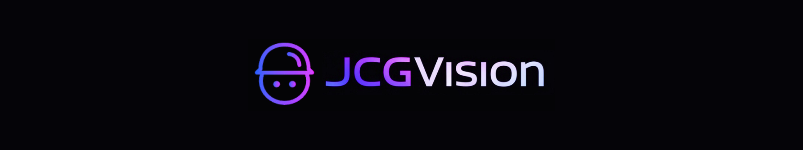

<p align="center">
  
</p>

<h1 align="center">Generative AI + Anomaly Detection on CIFAR-10</h1>

<br>

<p align="center">Developed by <a href="https://www.linkedin.com/in/juancarlosgarzon/">Juan Carlos Garzon</a>, <a href="https://www.linkedin.com/in/vivialves-developer/">Viviane Alves</a> </p>

<br>

<div align="center">
  
[](https://github.com/Juank0621)
[](https://www.linkedin.com/in/juancarlosgarzon)

[](https://github.com/Juank0621/CIFAR10_GenerativeAI/blob/main/LICENSE)

</div>


<p align="center">
  
</p>


## 🎥 Demo VIDEO
*(Insert link to video demo here)*

---

## 📚 Dataset

The project uses the **CelebA** dataset for training and testing. Ensure the dataset is downloaded and placed in the `./data/celeba` directory. The dataset should contain `.jpg` images.

---

## 🎯 Project Goal

This project implements **Super-Resolution Generative Adversarial Networks (SRGAN)** to enhance low-resolution images to high-resolution quality. The implementation includes:
- **Pretraining the Generator (SRResNet)** using MSE loss.
- **Training the full SRGAN** with adversarial and perceptual loss.
- **Evaluation and visualization** of results using PSNR and SSIM metrics.

---

## 🛠️ Key Components

- **Dataset**: CelebA
- **Models**:
  - Generator (SRResNet)
  - Discriminator
- **Loss Functions**:
  - Adversarial Loss
  - Perceptual Loss (VGG-based)
  - Image Reconstruction Loss (MSE)
- **Evaluation Metrics**:
  - Peak Signal-to-Noise Ratio (PSNR)
  - Structural Similarity Index (SSIM)
- **Visualization**:
  - Side-by-side comparison of low-resolution, super-resolution, and high-resolution images.

---

## 🚀 Getting Started

To get started with the **SRGAN for Super-Resolution** project, follow the steps below. The models were trained using **Visual Studio Code**, running on **Linux Ubuntu**, with an **NVIDIA GeForce RTX 4080 GPU**.

### Prerequisites
- **Python 3.8+**
- **PyTorch** and **torchvision**
- **Matplotlib**, **scikit-image**, **tqdm**, **Pillow**
- **CUDA** (optional, for GPU acceleration)

Install the required Python packages using:
```bash
pip install -r requirements.txt
```

---

## Files Overview

### `part3.py`
This script contains the main implementation of the SRGAN model, including:
- Dataset preparation (`CelebADataset` class)
- Model definitions (`Generator`, `Discriminator`, `ResidualBlock`)
- Loss functions (`Loss` class)
- Training functions (`train_srresnet`, `train_srgan`)
- Evaluation and visualization functions (`evaluate`, `visualize_samples`)

#### Usage
1. **Pretrain the Generator (SRResNet):**
   Run the script to pretrain the generator using MSE loss:
   ```bash
   python part3.py
   ```
   The pretrained generator will be saved as `models/srgan/srresnet_pretrained.pth`.

2. **Train the Full SRGAN:**
   After pretraining, the script will train the full SRGAN model using adversarial and perceptual loss. The trained models will be saved as:
   - `models/srgan/srgenerator.pth`
   - `models/srgan/srdiscriminator.pth`

3. **Evaluate the Model:**
   The script evaluates the trained generator on the test dataset and calculates PSNR and SSIM metrics.

4. **Visualize Results:**
   The script includes a function to visualize low-resolution, super-resolution, and high-resolution images side-by-side.

### `part3.ipynb`
This Jupyter Notebook provides an interactive environment for:
- Running the training and evaluation steps in smaller, modular cells.
- Visualizing intermediate results and metrics during training.
- Experimenting with different hyperparameters and configurations.

#### Usage
1. Open the notebook:
   ```bash
   jupyter notebook part3.ipynb
   ```
2. Follow the cells sequentially to:
   - Load the dataset.
   - Train the SRGAN model.
   - Evaluate and visualize results.

---

## 📸 Screenshots

### Training Progress
Monitor PSNR and SSIM metrics during training:


### Visualized Results
Compare LR, SR, and HR images side-by-side:


---

## Directory Structure

```
Final_Project/
├── backend/
│   ├── part3.py
│   ├── part3.ipynb
│   ├── models/
│   │   ├── srgan/
│   │   │   ├── srresnet_pretrained.pth
│   │   │   ├── srgenerator.pth
│   │   │   ├── srdiscriminator.pth
│   ├── data/
│   │   ├── celeba/
│   │   │   ├── *.jpg
```

---

## ⚙️ Tech Stack

- **PyTorch**
- **Matplotlib**
- **scikit-image**
- **tqdm**

---

## Acknowledgments

This project is based on the SRGAN architecture described in the paper:
- [Photo-Realistic Single Image Super-Resolution Using a Generative Adversarial Network](https://arxiv.org/abs/1609.04802)

---

## License

This project is licensed under the MIT License.
