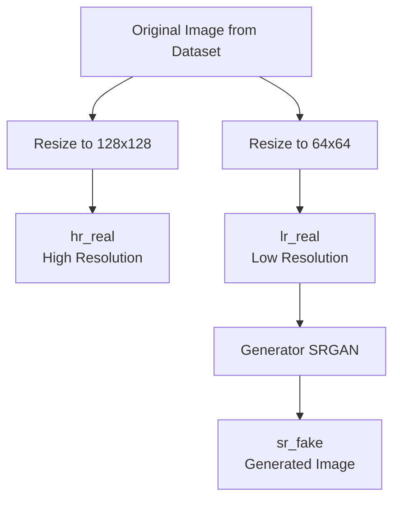

```mermaid
graph TD
    A[Original Image from Dataset] --> B1[Resize to 128x128]
    A --> B2[Resize to 64x64]
    B1 --> C1[hr_real<br/>High Resolution]
    B2 --> C2[lr_real<br/>Low Resolution]
    C2 --> D[Generator SRGAN]
    D --> E[sr_fake<br/>Generated Image]
```